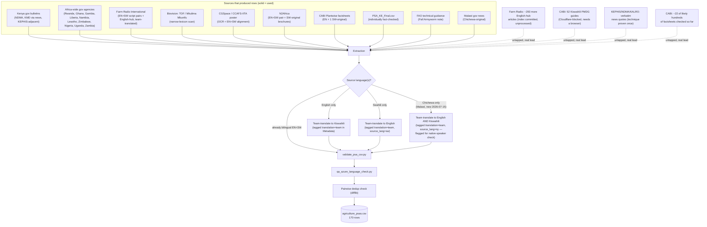

# Agriculture domain — orientation

Quick map of what's in this folder and how `agriculture_psas.csv` got built. For the full
research log (every source checked, what was rejected and why, methodology decisions) see
[`SOURCES.md`](SOURCES.md) in this same folder — that file is the detailed record; this one
is the fast way to find things.

**Current state: 170 rows** in `agriculture_psas.csv`, full pipeline re-run clean
(`validate_psa_csv.py`, `qa_azure_language_check.py`, pairwise dedup — see `SOURCES.md`
for the 2026-07-15 continuation log). Note: 2 rows (`AGRI_169`-`170`) are translated from
Chichewa, not English — the project's first non-English/Kiswahili source — flagged for a
native-speaker check before final submission.

| Sub-category | Rows |
|---|---|
| Crop Production | 92 |
| Livestock | 40 |
| Sustainable Farming | 30 |
| Agribusiness | 8 |

## What's where

| Path | What it is |
|---|---|
| `agriculture_psas.csv` | **The deliverable.** English/Kiswahili PSA pairs in the shared schema (see `../README.md` for the schema itself). |
| `SOURCES.md` | Full research log — every source checked, confirmed matches, rejected leads, and why. Read this for "why is X included/excluded." |
| `CGSPACE_FETCH_LIST.md` | Specific CGSpace bitstream UUIDs identified as bilingual pairs or Swahili-original, with download links. |
| `farmradio_manual/` | Downloaded source material — see its own `README.md` for the breakdown. `confirmed_pairs/` (4 files) has the true bilingual pairs used directly; `tof_magazine_en/` (248 files) and `mkulima_mbunifu_sw/` (129 files) are the bulk-fetched magazine archives narrow-lexicon-scanned for usable content; `farm_radio_scripts/` (3 files) is an early hand-picked sample. |
| `_candidates_farmradio.csv` | Gitignored — bulk-crawled Farm Radio EN+SW pairs from the Swahili-locale "kilimo" hub. Human-reviewed 2026-07-15: 13 of 52 promoted into the main CSV (drama/dialogue-only rows without a clear standalone directive were left out; see `SOURCES.md`). |
| `FARMRADIO_ENGLISH_HUB_INDEX.md` | Full 300-article index of the separate English-language `topic/agriculture/` hub (pages 1-30 of 94) — 7 promoted so far, ~293 unprocessed leads for a future pass. |

## Scripts (`../../scripts/`)

| Script | What it does |
|---|---|
| `validate_psa_csv.py` | Schema/structure check — run this after any edit to the CSV. |
| `qa_azure_language_check.py` | Confirms each English/Kiswahili cell is actually in the language it claims to be, via Azure Text Analytics. |
| `collect/fetchlib.py` | Shared polite-fetch helper (robots.txt, rate-limiting, caching) — every other `fetch_*.py` script routes through this. |
| `collect/fetch_n2africa.py` | N2Africa's extension-materials catalog (n2africa.org/agem). |
| `collect/fetch_cgspace.py` | CGSpace (CGIAR) bitstream download + text extraction by UUID. |
| `collect/fetch_infonet_magazines.py` | TOF Magazine / Mkulima Mbunifu back-issue archive from Infonet-Biovision. |
| `collect/fetch_farmradio.py` | Farm Radio International EN+SW script pairs (via the hreflang pairing trick — see its docstring). |
| `collect/fetch_kenya_gov_recon.py`, `fetch_all_counties_recon.py` | Read-only recon passes over Kenyan government sites — print findings, don't write to the CSV. |
| `collect/x_collect.py` | Official X/Twitter account scraper (twscrape-based), for gov/NGO bilingual posts. |
| `collect/local_collect_facebook_cgspace.py` | Meant to be run on a personal device, not here — Facebook Pages need a logged-in browser session. |

All bulk-download scripts print an estimated file count/size and ask for confirmation before
writing anything to disk (skip with `PSA_AUTO_CONFIRM=1`).

## Pipeline: how the 170 rows got here

## How it was actually done (brief)

1. **Find an agency/publication with genuinely directive content** — not news, not a research
   report, not an internal government memo. The bar: would a farmer reading this know exactly
   what to do? (Full rationale for what passed/failed this bar is in `SOURCES.md`.)
2. **Prefer a source that's already bilingual.** Government "recommendations" sections,
   Farm Radio's hreflang-paired scripts, and a couple of directly-authored EN+SW documents
   (the CGSpace poster, one N2Africa checklist) needed no translation at all.
3. **Where only one language exists**, team-translate the other side rather than skip the
   row — tagged in `Metadata` (`translation=team; source_lang=en|sw; country=X`) so it's
   never confused with a genuine source pair.
4. **Verify before extracting**, don't extract before verifying. Several leads that looked
   promising (research citations, press-release paraphrases, generic unattributed claims)
   were checked against a real, findable, citable source and rejected when they turned out
   to be news/research framing rather than an actual directive.
5. **Validate every batch**: `validate_psa_csv.py` (schema/structure) →
   `qa_azure_language_check.py` (does the English column read as English, the Kiswahili
   column as Kiswahili) → a pairwise fuzzy-similarity dedup pass. No row skips this.
