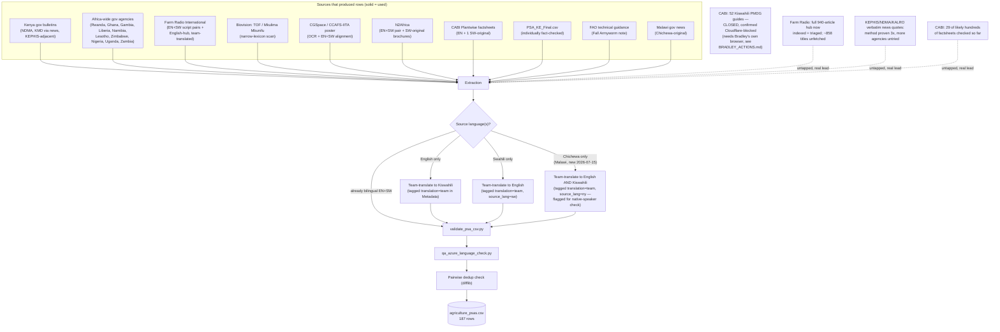

# Agriculture domain — orientation

Quick map of what's in this folder and how `agriculture_psas.csv` got built. For the full
research log (every source checked, what was rejected and why, methodology decisions) see
[`SOURCES.md`](SOURCES.md) in this same folder — that file is the detailed record; this one
is the fast way to find things.

**Current state (2026-07-27): 11,695 rows** in `agriculture_psas.csv` — **1,658 real**
(independently sourced/verified) **+ 10,037 synthetic** (template-generated by main's
`psa_pipeline`, real authority names but fabricated announcements — every synthetic row
is tagged `provenance=synthetic` in `Metadata`, so `grep -v provenance=synthetic` or a
pandas filter on that string always recovers the real-only 1,658-row set). Full pipeline
re-run clean (`validate_psa_csv.py`, `qa_azure_language_check.py`, pairwise dedup — see
`SOURCES.md` for the full narrative of every milestone, this file only tracks current
state). Language coverage: **Kiswahili/Somali/Dholuo 100% filled** (Somali/Dholuo added
2026-07-27 via NLLB-200, with Azure Translator as an independent second opinion for
Somali specifically); **Ekegusii 8.2%** (961/11,695 — a denominator effect, not a
regression: none of the synthetic rows have Ekegusii coverage since no pretrained MT
model exists for it; within the real-only 1,658 rows Ekegusii is 58%). 2 rows
(`AGRI_169`-`170`) are translated from Chichewa, not English — flagged for a
native-speaker check before final submission.

**`PSA_ID` numbers are not a row count.** IDs are assigned once and never reused or
renumbered — if a row is later found to be a duplicate and merged into another row, its
ID is retired rather than reassigned, leaving a gap. So the highest `AGRI_###` in the
file will not always equal the total row count, and that's expected, not a bug: trust an
actual count (`validate_psa_csv.py`'s output, or counting rows directly) as the source of
truth for "how many rows," not the max ID. This holds regardless of how the dataset
changes going forward.

| Sub-category | Rows (all) | Rows (real only) |
|---|---|---|
| Crop Production | 3,988 | 861 |
| Livestock | 3,563 | 263 |
| Training | 1,845 | 47 |
| Sustainable Farming | 1,522 | 146 |
| Agribusiness & Market Access | 471 | 242 |
| Food Security | 298 | 91 |
| Agribusiness | 8 | 8 |

## What's where

| Path | What it is |
|---|---|
| `agriculture_psas.csv` | **The deliverable.** English/Kiswahili/Somali/Dholuo (+ partial Ekegusii) PSA rows, real and tagged-synthetic mixed (see `Metadata`'s `provenance=synthetic` tag) — schema is agriculture's own extended version of the shared one (see `../README.md`'s schema section for the shared core fields and the note on the two extra language columns). |
| `SOURCES.md` | Full research log — every source checked, confirmed matches, rejected leads, and why. Read this for "why is X included/excluded." |
| `CGSPACE_FETCH_LIST.md` | Specific CGSpace bitstream UUIDs identified as bilingual pairs or Swahili-original, with download links. |
| `farmradio_manual/` | Downloaded source material — see its own `README.md` for the breakdown. `confirmed_pairs/` (4 files) has the true bilingual pairs used directly; `tof_magazine_en/` (248 files) and `mkulima_mbunifu_sw/` (129 files) are the bulk-fetched magazine archives narrow-lexicon-scanned for usable content; `farm_radio_scripts/` (3 files) is an early hand-picked sample. |
| `_candidates_farmradio.csv` | Gitignored — bulk-crawled Farm Radio EN+SW pairs from the Swahili-locale "kilimo" hub. Human-reviewed 2026-07-15: 13 of 52 promoted into the main CSV (drama/dialogue-only rows without a clear standalone directive were left out; see `SOURCES.md`). |
| `FARMRADIO_ENGLISH_HUB_INDEX.md` | Index of the separate English-language `topic/agriculture/` hub — now fully crawled (all 94 pages, 940 articles total, not the ~300 previously recorded). ~21 rows promoted from it across sessions; top 80 candidates triaged by keyword scoring this session, ~858 titles not yet even fetched. Large real lead for a future pass. |

## Scripts (`../../scripts/`)

| Script | What it does |
|---|---|
| `validate_psa_csv.py` | Schema/structure check — run this after any edit to the CSV. Schema now includes Somali/Dholuo as mandatory columns, added 2026-07-27 for agriculture's own use — **not yet a team decision for the other four domains**, flag this before merging this script's changes into `main`. |
| `qa_azure_language_check.py` | Confirms each English/Kiswahili/Somali cell is actually in the language it claims to be, via Azure Text Analytics (Dholuo isn't covered — Azure has no language-ID support for it, same gap as Azure Translator). |
| `collect/fetchlib.py` | Shared polite-fetch helper (robots.txt, rate-limiting, caching) — every other `fetch_*.py` script routes through this. |
| `collect/fetch_n2africa.py` | N2Africa's extension-materials catalog (n2africa.org/agem). |
| `collect/fetch_cgspace.py` | CGSpace (CGIAR) bitstream download + text extraction by UUID. |
| `collect/fetch_infonet_magazines.py` | TOF Magazine / Mkulima Mbunifu back-issue archive from Infonet-Biovision. |
| `collect/fetch_farmradio.py` | Farm Radio International EN+SW script pairs (via the hreflang pairing trick — see its docstring). |
| `collect/fetch_kenya_gov_recon.py`, `fetch_all_counties_recon.py` | Read-only recon passes over Kenyan government sites — print findings, don't write to the CSV. |
| `collect/x_collect.py` | Official X/Twitter account scraper (twscrape-based), for gov/NGO bilingual posts. |
| `collect/local_collect_facebook_cgspace.py` | Meant to be run on a personal device, not here — Facebook Pages need a logged-in browser session. |

All bulk-download scripts print an estimated file count/size and ask for confirmation before
writing anything to disk (skip with `PSA_AUTO_CONFIRM=1`).

## What happened after the original 187 rows (2026-07-22 to 2026-07-27)

The diagram below is the original collection pipeline and is still accurate for how
those first 187 rows came together — it predates four later milestones, kept as prose
here rather than redrawn into the diagram (full detail always in `SOURCES.md`):

1. **Ekegusii Corpus promotion (2026-07-22)**: 913 of 925 lecturer-provided
   English→Ekegusii rows promoted in, Kiswahili filled via 3-tool comparison
   (`translate_and_qa.py`). 187 → 1,093 rows.
2. **Main-branch reconciliation (2026-07-27)**: 565 real, independently-sourced rows
   recovered from main's own parallel data collection (`kilimo.go.ke`/`kilimonews.co.ke`
   + a curated `PSA_KE_Final.csv` subset), after a real-source audit that rejected 34
   citation/contact-block fragments and 8 corrupted duplicates. 1,093 → 1,658 rows.
3. **Somali + Dholuo added (2026-07-27)**: NLLB-200 for every row, Azure Translator as
   an independent second opinion for Somali specifically (62% of rows switched to
   Azure's better candidate). Both now 100% filled.
4. **Synthetic rows integrated (2026-07-27)**: main's 10,037-row template-generated
   pool, translated via a Kaggle GPU kernel and merged in tagged
   `provenance=synthetic`. 1,658 → 11,695 rows.

## Pipeline: how the original 187 rows got here

## How it was actually done (brief)

1. **Find an agency/publication with genuinely directive content** — not news, not a research
   report, not an internal government memo. The bar: would a farmer reading this know exactly
   what to do? (Full rationale for what passed/failed this bar is in `SOURCES.md`.)
2. **Prefer a source that's already bilingual.** Government "recommendations" sections,
   Farm Radio's hreflang-paired scripts, and a couple of directly-authored EN+SW documents
   (the CGSpace poster, one N2Africa checklist) needed no translation at all.
3. **Where only one language exists**, team-translate the other side rather than skip the
   row — tagged in `Metadata` (`translation=team; source_lang=en|sw; country=X`) so it's
   never confused with a genuine source pair.
4. **Verify before extracting**, don't extract before verifying. Several leads that looked
   promising (research citations, press-release paraphrases, generic unattributed claims)
   were checked against a real, findable, citable source and rejected when they turned out
   to be news/research framing rather than an actual directive.
5. **Validate every batch**: `validate_psa_csv.py` (schema/structure) →
   `qa_azure_language_check.py` (does the English column read as English, the Kiswahili
   column as Kiswahili) → a pairwise fuzzy-similarity dedup pass. No row skips this.
