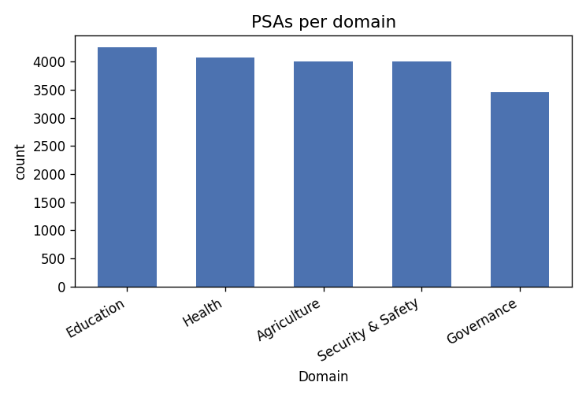
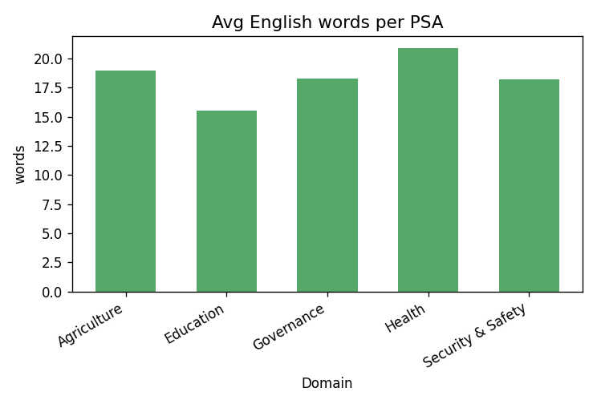

# Week 2 Report — PSA Dataset: Cleaning, Curation & EDA

**DSA 4020A: Natural Language Processing · Group One**
_Week 2: Data Processing & Exploratory Data Analysis_

---

## 1. Executive Summary

This report documents progress on the parallel Public Service Announcement (PSA) dataset. Raw PSAs collected by the team were combined with generated data and merged into a single dataset of **19,816 records across 6 columns** (`PSA_ID, Domain, English, Kiswahili, Ekegusii, Data_Source`). The merged data was passed through a cleaning pipeline — text normalisation, deduplication, language detection and relevance filtering — leaving **19,795 curated PSAs**. No machine-translation step was required: the dataset arrives with **all three languages already aligned**, so English, Kiswahili and Ekegusii each reach **100% coverage (19,795 aligned sentences)**.

This is a substantial advance on the ≥5,000 parallel-sentence milestone. Both the **English–Kiswahili** and, critically, the low-resource **English–Ekegusii** pairs now stand at ~19,795 aligned sentences each — roughly four times the target — giving the modelling phase a genuine parallel corpus for the indigenous language, not just for Kiswahili. Of the curated records, **24.2% (4,795) are real-collected** and **75.8% (15,000) are synthetic-generated**.

---

## 2. Data Provenance: Where the Data Came From

Provenance is recorded per record in the **`Data_Source`** column, which takes two values: **real_collected** (gathered from live sources) and **synthetic_generated** (produced to expand coverage, especially for the low-resource Ekegusii pair).

| Data source | Records | Share |
|---|--:|--:|
| real_collected | 4,795 | 24.2% |
| synthetic_generated | 15,000 | 75.8% |
| **Total** | **19,795** | **100%** |

The **real_collected** portion draws on **150+ distinct sites and institutions**, comfortably satisfying the ≥10 reliable-source requirement. Sources span Kenyan government portals, regulatory authorities, health and agricultural bodies, NGOs, news agencies, official social-media accounts, and OCR-extracted field documents.

### Principal real-collected sources by contribution

| Source / Site | Type |
|---|---|
| kenyanews.go.ke — Kenya News Agency | Govt news |
| kilimonews.co.ke / kilimo.go.ke | Agriculture news & ministry |
| education.go.ke, kicd.ac.ke, kemi.ac.ke, TVET | Education (govt) |
| ODPP — Office of the Director of Public Prosecutions | Justice / governance |
| Open Government Partnership News | Governance |
| EACC & EACC News (Anti-Corruption) | Governance |
| WHO, CDC, NICD, ECDC, NHS England, PMC | Health (intl.) |
| NTSA, NC4 | Security & safety (govt) |
| Farm Radio Intl., CABI Plantwise, N2Africa, CGSpace | Agri-extension / NGO |
| KenyaGazette | Official gazette |
| GoogleNews_en, Tuko, Capital FM, BBC Swahili | News aggregators / media |

---

## 3. Dataset Composition

Each record follows the schema:

`PSA_ID · Domain · English · Kiswahili · Ekegusii · Data_Source`

### Records per domain (category)

| Domain (category) | Records | Share |
|---|--:|--:|
| Education | 4,256 | 21.5% |
| Health | 4,069 | 20.6% |
| Agriculture | 4,006 | 20.2% |
| Security & Safety | 4,001 | 20.2% |
| Governance | 3,463 | 17.5% |
| **Total** | **19,795** | **100%** |

The domains are now well balanced, ranging from **17.5% to 21.5%**. A data-quality fix was applied: the collection phase produced two overlapping labels, **Security** and **Security & Safety**, which have been **merged into a single Security & Safety domain** (their per-domain statistics were nearly identical).

---

## 4. Cleaning Pipeline & Results

The merged CSV was processed in a Jupyter notebook (`psa_cleaning_EDA.ipynb`). Stemming and lemmatisation were intentionally **not** applied, to preserve raw parallel text for downstream translation modelling. Steps, in order:

1. **Text cleaning** — Unicode normalisation (NFKC) folded stylised glyphs back to plain text; URLs, @handles/#hashtags, emoji and all non-alphanumeric characters were stripped, and whitespace collapsed. Cleaning was applied to all three text columns — English, Kiswahili and Ekegusii.
2. **Empty-English removal** — records with no usable English source after cleaning were dropped (0 in this run).
3. **Deduplication** — exact duplicates on normalised English were removed (12 records).
4. **Language detection** — each English cell was tagged with `langdetect`; 19,703 were confidently English, the remainder a small multilingual tail flagged for review.
5. **Relevance filtering** — records too short (<3 words, 1) or confidently non-English (8) were routed to a review file rather than deleted (9 total).
6. **Export** — the curated table was written to `psa_main_transformed.csv` (19,795 rows, 6 columns). No translation step was needed, since all three languages were already populated.

### Cleaning funnel

| Stage | Records removed | Records remaining |
|---|--:|--:|
| Merged raw dataset | — | 19,816 |
| After empty-English removal | 0 | 19,816 |
| After exact deduplication | 12 | 19,804 |
| After relevance filtering | 9 | 19,795 |

---

## 5. Summary Statistics

### 5.1 Volume & length

- Total curated PSAs: **19,795**
- Total English words: **363,152**
- Total Kiswahili words: **421,193**
- Total Ekegusii words: **421,356**
- Average English words per PSA: **18.3** (median 18); min / max: 3 / 111

### 5.2 Volume & average length, by domain

| Domain | PSAs | English words | Avg words / PSA |
|---|--:|--:|--:|
| Health | 4,069 | 85,032 | 20.9 |
| Agriculture | 4,006 | 76,066 | 19.0 |
| Governance | 3,463 | 63,435 | 18.3 |
| Security & Safety | 4,001 | 72,781 | 18.2 |
| Education | 4,256 | 65,838 | 15.5 |

### 5.3 Target-language coverage

| Language column | Records filled | Coverage |
|---|--:|--:|
| English (source) | 19,795 / 19,795 | 100.0% |
| Kiswahili | 19,795 / 19,795 | 100.0% |
| Ekegusii | 19,795 / 19,795 | 100.0% |

**Milestone check:** both the English–Kiswahili and English–Ekegusii pairs stand at **19,795 aligned sentences (100% coverage)** — each roughly four times the ≥5,000 parallel-sentence target. Crucially, the milestone is now met for the low-resource Ekegusii pair as well, not only for Kiswahili.

### 5.4 Domain distribution (charts)

_Figure 1. Number of PSAs per domain (Security merged into Security & Safety)._

_Figure 2. Average English words per PSA, by domain._

---

## 6. Challenges Faced

- **No reusable scraper across sites:** every source had its own HTML structure, so a single scraper could not be reused. Per-site parsers (BeautifulSoup selectors) had to be written and maintained, and minor layout changes on a site silently broke extraction until the parser was fixed.
- **robots.txt, rate limits and anti-bot blocking:** several government and news portals throttle or block automated requests. Scraping had to respect robots.txt, add delays and retries to stay within rate limits, and rotate/space out requests; where a site blocked automation entirely, records were collected manually, which slowed throughput.
- **JavaScript-rendered / dynamic pages:** some portals load PSAs client-side, so plain HTTP requests returned empty or partial pages. These sites needed a headless browser (Selenium) to render the content before it could be scraped, which is slower and more fragile than static requests.
- **Pagination, session and structure drift:** content spread across paginated listings, search results and expandable sections; some pages required cookies/sessions, and a few sites changed their markup mid-collection, forcing scrapers to be re-run and re-written partway through.
- **OCR noise from PDF and scanned sources:** gazettes and field documents were only available as scanned PDFs/images. OCR introduced character errors, broken words, hyphenation and layout artefacts that required extra cleaning beyond the standard text pipeline.
- **Source heterogeneity:** the real-collected portion came from 150+ sources in inconsistent formats, requiring per-source normalisation before merging.
- **Typographic & encoding noise:** social-media text carried stylised Unicode (bold-math letters), emoji, smart quotes and hashtags/handles; NFKC normalisation was needed so these folded to plain text instead of being silently deleted.
- **Language-detection unreliability:** `langdetect` misclassifies short, proper-noun-heavy PSA headlines as non-English (a small tail of ca/fr/it/ro/da/nl/es/de tags appeared). A conservative filter plus a manual-review file were used so valid records were never discarded automatically — only 9 rows were set aside.
- **Coarser provenance metadata:** the modelling file records provenance only as real vs synthetic; the finer per-source and date metadata from the collection phase is not carried into `psa_main_transformed.csv`.
- **Contributor duplication:** merging separate scrapes introduced 12 exact duplicates (removed); near-duplicates may remain, as only exact-match deduplication on normalised English has been applied so far.

---

