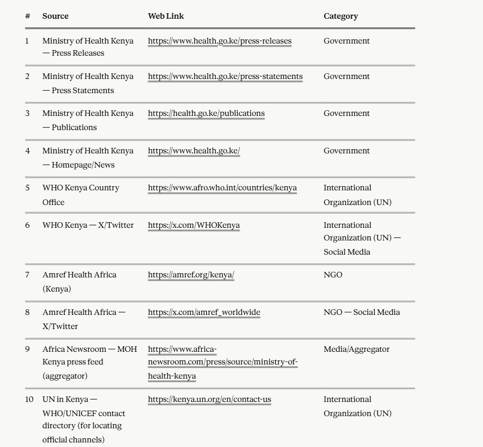

# Health Domain Scraper Kit (v2 — config-driven, all 10 sources)

## What changed from v1
Instead of writing a new `fetch_<source>.py` file every time a site's structure
needs adjusting, all 10 sources now live as entries in **`sources_config.py`**.
One script, **`generic_fetch.py`**, iterates over that list. To add or fix a
source, you edit a config entry — you don't touch the fetching logic itself.


```
health_scraper_v2/
├── fetchlib.py               # shared polite-fetch engine (unchanged from v1)
├── sources_config.py         # all 10 sources as config entries (edit this)
├── generic_fetch.py          # the one script that reads sources_config.py
├── scripts/
│   ├── structure_candidates.py
│   └── validate_psa_csv.py
└── README.md
```

## Install
```bash
pip install requests beautifulsoup4 lxml pandas langdetect --break-system-packages
```

## 1. See all 10 sources and their status
```bash
python generic_fetch.py --list-sources
```
Output shows each source's category (Government / NGO / International
Organization / Media / Social Media) and whether it's **ACTIVE** (ready to
scrape) or **MANUAL ONLY** (a placeholder still needing setup, or genuinely
not automatable — e.g. X/Twitter, PDF archives).

Right now: **2 active** (`moh_kenya_press_releases`, `moh_kenya_press_statements`),
**8 placeholders**. That's expected — not every source needs a script; some are
meant to stay manual per the project's "hybrid" approach.

## 2. List article links for one active source
```bash
python generic_fetch.py --source moh_kenya_press_releases --list
```
Or run every active source at once:
```bash
python generic_fetch.py --all --list
```

## 3. Fetch and inspect one specific article
```bash
python generic_fetch.py --source moh_kenya_press_releases --fetch <url>
```
Prints the title and body text so you can manually confirm a Swahili
version of the same article exists before using it.

## 4. Activating a placeholder source
Open `sources_config.py`, find the source's entry, then:
1. Open its `index_url` in a browser, view page source.
2. Find the link pattern used for individual articles → fill in `article_link_re`.
3. Open one article → find the title tag and body container → fill in
   `title_selector` and `body_selector`.
4. Set `"manual_only": False`.
5. Re-run `python generic_fetch.py --source <name> --list` to confirm it now
   finds links.

If a source genuinely can't be scripted (X/Twitter, PDF-only archives,
aggregators with no real structure) — leave it `manual_only: True`. That's
not a failure; it's an accurate reflection of what the hybrid pipeline
expects.

## 5. Turn confirmed pairs into the schema, then validate
Same as before — build a small candidate CSV by hand as you review articles,
then:
```bash
python scripts/structure_candidates.py \
  --input _candidates_moh.csv \
  --output health_psas.csv \
  --domain Health \
  --subcategory "Disease Prevention and Control" \
  --prefix HEALTH \
  --eng-col english_text \
  --sw-col swahili_text \
  --source-col source_url \
  --date-col date

python scripts/validate_psa_csv.py health_psas.csv
```

## Current source inventory (from sources_config.py)

| Source | Category | Status |
|---|---|---|
| moh_kenya_press_releases | Government | Active |
| moh_kenya_press_statements | Government | Active |
| moh_kenya_publications | Government | Placeholder (likely PDFs) |
| who_afro_kenya | International Organization | Placeholder |
| who_kenya_twitter | Intl Org — Social Media | Manual (X/Twitter) |
| amref_kenya | NGO | Placeholder |
| amref_twitter | NGO — Social Media | Manual (X/Twitter) |
| africa_newsroom_moh | Media/Aggregator | Placeholder |
| un_kenya_directory | International Organization | Directory only, not a content source |
| kemri | Government — Research Institute | Placeholder |

## Notes
- `fetchlib.py` checks `robots.txt` automatically before every new domain — if
  disallowed, it raises `PermissionError` rather than silently failing.
- Nothing is added to your dataset automatically — every candidate pair still
  needs a human to confirm both language versions genuinely match before
  running `structure_candidates.py`.
